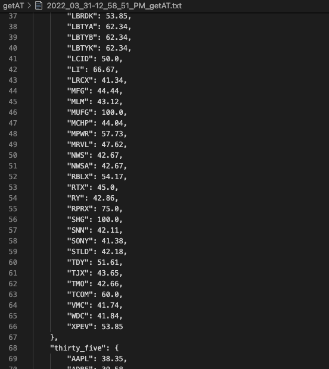

# getAT.py
get All Tickers

Return 'Buy' consensus ratios for hundreds of companies (>2000 M market cap)

`$python3 getAT.py`

Outputs JSON (stock ticker : consensus buy ratio) into text file. Brackets companies into tiers, the greater the buy percent, the higher consensus amongst investment banks to buy. 

*NOTE: The API used is rate limited. The program will run for ~30 minutes and occasionally print result letter by letter to the command line

